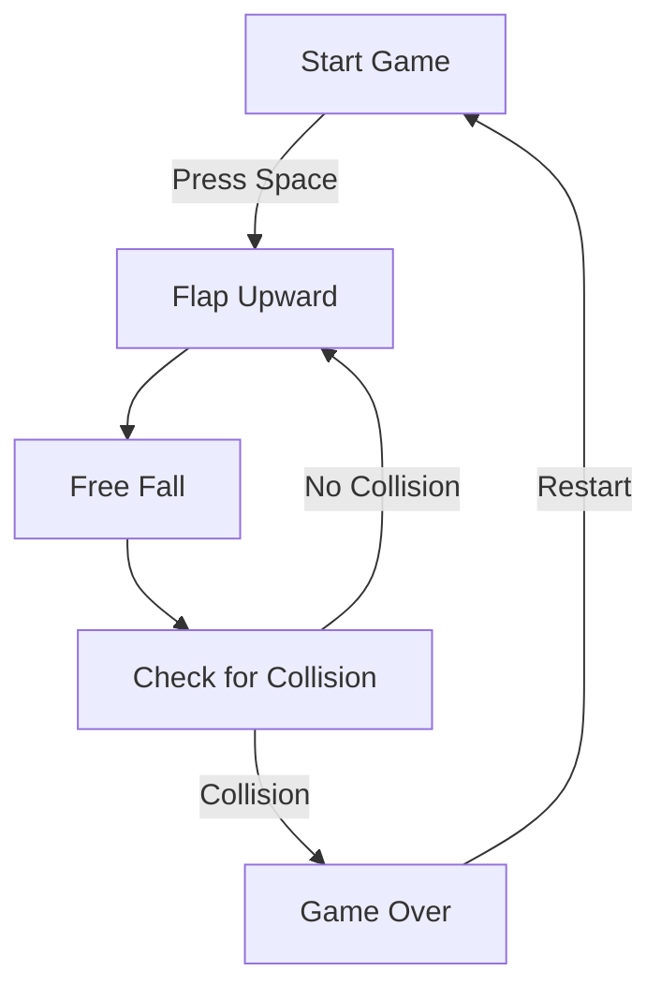

# Bambi the Flappy

## Introduction

**Bambi the Flappy** is a playful Flappy Bird-inspired game developed for desktop platforms. The game features a unique character, Bambi, navigating through a series of obstacles with simple controls. This project is an excellent reference for beginner game developers and a fun way for users of all ages to enjoy a classic arcade-style challenge.

## Features

- Classic Flappy Bird gameplay mechanics
- Custom character and graphics
- Responsive controls for a smooth experience
- Scorekeeping and game-over logic
- Sound effects for enhanced gameplay
- Easily customizable assets and settings

## Requirements

Before installing and running Bambi the Flappy, ensure you have the following dependencies:

- Python 3.7 or higher
- `pygame` library (for graphics and input)
- Compatible with Windows, macOS, and Linux

## Installation

Follow these steps to install and launch Bambi the Flappy on your system:

1. Clone the repository:
   ```bash
   git clone https://github.com/AungKaung1971/bambi_the_flappy.git
   cd bambi_the_flappy
   ```
2. Install required Python packages:
   ```bash
   pip install -r requirements.txt
   ```
3. Run the game:
   ```bash
   python main.py
   ```

## Usage

Start the game by running the main script. Use your keyboard to control Bambi and try to pass through as many obstacles as possible to achieve a high score.

- **Spacebar or Mouse Click:** Make Bambi flap upward.
- **Escape or Q:** Quit the game at any time.

The game displays your current score and keeps track of your highest score during the session.

### Basic Gameplay Flow



## Configuration

You can customize various aspects of the game by editing configuration variables in the source code:

- **Graphics:** Replace asset images in the `assets/` folder.
- **Sound Effects:** Add or replace sound files in the `assets/sounds/` directory.
- **Difficulty:** Adjust game speed and obstacle frequency in `main.py` or the relevant configuration file.

For more advanced modifications, explore the main game loop and functions to tweak physics or add new features.

## Contributing

Contributions are welcome! To contribute:

- Fork the repository
- Create a new branch for your feature or bugfix
- Submit a pull request with a clear description of your changes

Please ensure your code is well-documented and tested before submitting.

## License

This project is licensed under the MIT License. See the `LICENSE` file for details.

---

Enjoy helping Bambi flap through the forest! If you encounter issues or have ideas for improvement, please open an issue or submit a pull request.
